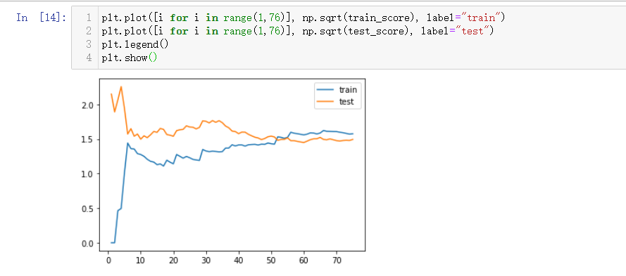
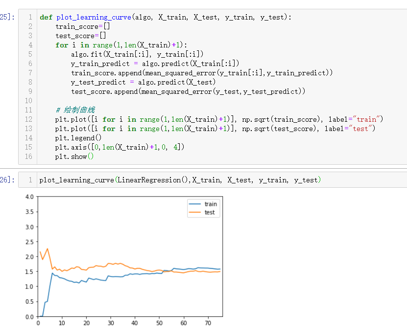
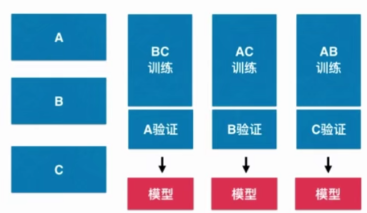

[toc]

# 多项式回归

对于非线性的数据，我们用线性回归的效果是不理想的，所以我们要考虑用多项式回归。对于$y=ax^2+bx+c$，这本身是一个线性回归的例子，从x的角度看，是一个非线性的方程。这就是**多项式回归**

## 算法实现

```python
import numpy as np
# 构造数据集
X = np.random.uniform(-3,3,size=100)
X=X.reshape(-1,1)

y=0.5*X**2+ X + 2
# 添加噪音
ran = np.random.normal(0,1,size=100).reshape(-1,1)
y = y + ran

# 使用线性回归来拟合数据集
from sklearn.linear_model import LinearRegression
lin_reg = LinearRegression()
lin_reg.fit(X,y)

# 但是，经过绘制直线发现拟合效果并不好

# 解决方法，添加一个特征
X2 = np.hstack([X,X**2])

# 建模
lin_reg2 = LinearRegression()
lin_reg2.fit(x2,y)
y_predict = lin_reg2.fit(X2,y)

plt.scatter(x,y)
plt.plot(np.sort(x[:,0]),y_predict[np.argsort(x[:,0])],'r')
plt.show()
```

这实际是一种对数据集升维的过程

## scikit-learn中的 PolyNomialFeatures

在多项式回归中，我们也需要做数据预处理，我们常用的是scikit-learn 中的PolynomiaFeatures

```python
from sklearn.preprocessing import PolynomiaFeatures
poly = PolynomiaFeatures(degree)# degree为几次幂
X2 = poly.transform(X)
```

实际上是这样的

```python
# 原始的数据[x1,x2]
# 当degree=2时，transform后的数据为[1,x1,x2,x1**2,x2**2,x1*x2]
```

$$
同理，degree=3
\\1,x_1,x_2
\\x_1^2,x_2^2,x_1x_2
\\x_1^3,x_2^3,x_1^2x_2,x_1x_2^2
$$

## 使用Pipeline

什么时pipline?

**Pipeline**可以将许多算法模型串联起来，比如将特征提取、归一化、分类组织在一起形成一个典型的机器学习问题工作流。主要带来两点好处：

1. 直接调用fit和predict方法来对pipeline中的所有算法模型进行训练和预测。
2. 可以结合grid search对参数进行选择。

总而言之，就是可以将几个数据预处理的步骤合并到一起，然后可以减少我们的工作。

```python
from sklearn.pipeline import Pipeline
from sklearn.preprocessing import StandarScaler
# 传入每一个步骤所对应的类
poly_rag = Pipeline([
    ("poly",PolynomialFeatures(degree=2)),
    ("std_scaler",StandarScaler()),
    ("lin_reg",LinearRegression())
])
# 相当于我们创建了一个适合多项式回归的一个类
poly_reg.fit(X,y)
y_predict = reg_reg.predict(X)
```

## 过拟合与欠拟合

多项式回归是我们解决非线性问题的一个很好的，但是过度使用，会造成过拟合的问题。多项式回归与线性回归一样，能够用均方误差或者R方来衡量准确率。

```python
from sklearn.metrics import mean_squared_error
y_predict = lin_reg.predict()
```

```python
def PolynomialRegreession(degree):
    return Pipeline([
        ("poly",PolynomialFeatures(degree=2)),
        ("std_scaler",StandarScaler()),
        ("lin_reg",LinearRegression())
	])
```

degree越大，对于训练集来说，score越高，但是，实际上，已经过拟合了(Overfitting)。如果过拟合，泛化能力会下降。

## 过拟合的解决

### 划分训练集和测试集

 在测试集上建立模型，在测试集上测试。训练集的准确率一般比测试集高。随着模型复杂度增加，训练集的准确率呈增大的趋势，测试集的准确率呈先增大后减小的趋势。

- 欠拟合 underfitting ：算法所训练的模型不能完整表述数据关系
- 过拟合 overfitting ：算法所训练的模型过多地表达了数据集间地噪音关系。

## 学习曲线

学习曲线指的是：随着训练样本地逐渐增多，算法训练出地模型的表现能力。

下面是学习曲线的绘制：

```python
import numpy as np
import matplotlib.pyplot as plt
np.random.seed(666)
# 构造数据集
X = np.random.uniform(-3,3,size=100)
X=X.reshape(-1,1)
y=0.5*X**2+ X + 2
# 添加噪音
ran = np.random.normal(0,1,size=100).reshape(-1,1)
y = y + ran

# 学习曲线
from sklearn.model_selection import train_test_split
from sklearn.metrics import mean_squared_error
X_train, X_test, y_train, y_test = train_test_split(X, y, random_state=10)
from 

from sklearn.linear_model import LinearRegression
train_score=[]
test_score=[]
for i in range(1,76):
    lin_reg = LinearRegression()
    lin_reg.fit(X_train[:i],y_train[:i])
    
    y_train_predict = lin_reg.predict(X_train[:i])
    train_score.append(mean_squared_error(y_train[:i],y_train_predict))
    y_test_predict = lin_reg.predict(X_test)
    test_score.append(mean_squared_error(y_test,y_test_predict))
    
    
# 绘制曲线
plt.plot([i for i in range(1,76)], np.sqrt(train_score), label="train")
plt.plot([i for i in range(1,76)], np.sqrt(test_score), label="test")
plt.legend()
plt.show()
```



```python
def plot_learning_curve(algo, X_train, X_test, y_train, y_test):
    train_score=[]
    test_score=[]
    for i in range(1,len(X_train)+1):
        algo.fit(X_train[:i], y_train[:i])
        y_train_predict = algo.predict(X_train[:i])
        train_score.append(mean_squared_error(y_train[:i],y_train_predict))
        y_test_predict = algo.predict(X_test)
        test_score.append(mean_squared_error(y_test,y_test_predict))
    
    # 绘制曲线
    plt.plot([i for i in range(1,len(X_train)+1)], np.sqrt(train_score), label="train")
    plt.plot([i for i in range(1,len(X_train)+1)], np.sqrt(test_score), label="test")
    plt.legend()
    plt.axis([0,len(X_train)+1,0, 4])
    plt.show()
```




## 验证数据集与交叉验证

 为了判断模型是否过拟合，我们分成训练数据、验证数据、测试数据。通过验证数据来多次调整出最优模型，最后我们以测试数据作为衡量最终模型性能的数据集。

为了提高准确率，我们通常使用交叉验证(Cross Validation) 
所谓交叉验证，就是将训练数据划分成若干分，以其中一份作为验证集，其他的作为训练，重复多次。



**K个模型的均值作为结果调参**

 ### 使用scikit-learn中的 cross_val_score

```pytho
from sklearn.model_selection import cross_val_score

knn_clf = KNeighborsClassifier()
score = cross_val_score(knn_clf,X_train, y_train)
score = np.mean(score)
```

 ### 回顾网格搜索

```python
from sklearn.model_selection import GridSearchCV

param_grid = {
    {
        'weights':['uniform'],
        'n_neighbors':[i for i in range(1,11)]
    },
    {
        'weights':['distance'],
        'n_neighbors':[i for i in range(1,11)],
        'p':[i for i in range(1,6)]
    }
}
knn_clf = KNeighborsClassifier()
grid_search = GridSearchCV(knn_clf,param_grid，cv=5)
grid_search.fit(X_train,y_train)
```

对于网格搜索，其实用的就是交叉验证。超参数cv是划分成多少份的意思，默认为3

### 留一法

把训练数据集分成m份，称为留一法(Leave-One_Out Cross Validation)
完全不受随机的影响，最接近模型真正的性能指标。缺点是计算量巨大。

## 偏差方差权衡 Bias Variance Trade off

- 方差：偏重于衡量数据整体是否集中或者分散
- 偏差：偏重于描述数据是否例目标数据是否有很大偏差

模型误差= 偏差(Bias) + 方差(Variance) + 不可避免的误差

- 导致偏差的主要原因：对问题本身的假设不正确，例如对非线性数据使用线性回归。

- 方差：数据一点点的扰动都会较大地影响模型。通常原因，使用地模型太复杂，如多项式回归。

  ---

- 有一些算法天生是高方差算法，例如kNN。**非参数学习**通常是高方差算法。因为不对数据进行任何假设。
- 有一些算法天生是高偏差算法，如线性回归。**参数学习**通常都是高方差算法，因为对数据具有极强的假设。

 偏差和方差通常是矛盾的。降低方差，会提高偏差。降低偏差，会提高方差。

**解决高方差的通常手段:**

1. 降低模型的复杂度
2. 减少数据维度
3. 降噪
4. 增加样本数
5. 使用验证集
6. **模型正则化**

 ## 模型泛化与岭回归

目标，使一下尽可能小
$$
\sum_{i=1}^{m}(y^{(i)}-\theta_0-\theta_1X_1^{(i)}-\theta_2X_2^{(i)}-\dots-\theta_nX_n^{(i)})
$$
即 使 $J(\theta)=MSE(y,\hat y ; \theta)$尽可能小

加入**模型正则化**，目标：使$J(\theta)=MSE(y,\hat y ; \theta)+\alpha \frac{1}{2}\sum_{i=1}^{n} \theta_i^2$ 尽可能小。

 理解：$\alpha$是一个新的超参数，如果等于0，那么优化的主要目标和没有正则化时候的一样。如果alpha无穷大，那么优化的相当于$MSE(y,\hat y ; \theta)$很小，优化的主要目标就变成了$\alpha \frac{1}{2}\sum_{i=1}^{n} \theta_i^2$

### 岭回归 Ridge Regression

目标：使$J(\theta)=MSE(y,\hat y ; \theta)+\alpha \frac{1}{2}\sum_{i=1}^{n} \theta_i^2$ 尽可能小。

alpha增大后，直线平滑，减少过拟合。

 ```python
 from sklearn.linear_model import Ridge
 
 def RidgeRegreession(degree,alpha):
     return Pipeline([
         ("poly",PolynomialFeatures(degree=degree)),
         ("std_scaler",StandarScaler()),
         ("ridge_reg",Ridge(alpha=alpha))
 	]) 
 ```

 ## LASSO

LASSO和岭回归类似，只不过使用了不同的指标。

LASSO Regression

Least Absolute Shrinkage and Selection Operator Regression

目标：使$J(\theta)=MSE(y,\hat y ; \theta)+\alpha \sum_{i=1}^{n} |\theta_i|$ 尽可能小。 

 ```python
 from sklearn.linear_model import Lasso
 
 def RidgeRegreession(degree,alpha):
     return Pipeline([
         ("poly",PolynomialFeatures(degree=degree)),
         ("std_scaler",StandarScaler()),
         ("lasso_reg",Lasso(alpha=alpha))
 	]) 
 ```

LASSO趋向于使一部分theta值变为0，所以可作为特征选择用。 

## L1, L2 和 弹性网络

$$
Ridge: \ \ \frac{1}{2}\sum_{i=1}^{n}\theta_i^2\\
LASS0: \ \ \sum_{i=1}^{n}|\theta_i| \\
MSE: \ \ \frac{1}{n}\sum_{i=1}^{n}|y_i-\hat y_i| \\
MAE: \ \  \frac{1}{n}\sum_{i=1}^{n}|y_i-\hat y_i|
$$

   

### L1正则， L2正则

$$
||X||_p = (\sum_{i=1}^n|x_i|^p)^{\frac{1}{p}}\\
Lp范数
$$

$$
Ridge: \ \ \frac{1}{2}\sum_{i=1}^{n}\theta_i^2 \ \ L2正则\\
LASSO: \ \ \sum_{i=1}^{n}|\theta_i| \ \ L1正则
$$

L0正则 
$$
J(\theta)=MSE(y,\hat y;\theta)+min\left\{ number-of-non-zero-\theta \right \}
$$
后面为非0 theta元素的个数

### 弹性网 Elastic Net

$$
J(\theta)=MSE(y,\hat y;\theta)+r\alpha\sum_{i=1}^n|\theta_i|+\frac{1-r}{2}\alpha\sum_{i=1}^{n}\theta_i^2
$$

弹性网结合上面两种正则化，弹性网结合了两种优点，能进行特征选择。

