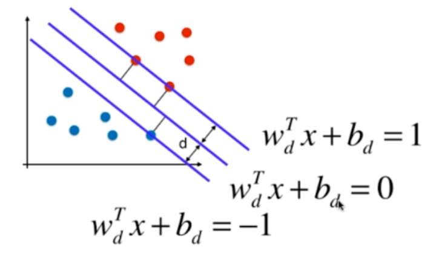

[toc]

# 支持向量机 SVM

支撑向量机  Support Vector Machine

## 什么是支持向量机

对于分类问题，决策边界并不唯一。**不适定问题**

- 支撑向量 ：上下两直线上的两点，确定margin的范围

- 支撑向量机的任务是最大化margin

**解决线性可分问题**

## 公式推导

点到直线的距离

$(x,y)到Ax+By+C=0的距离\frac{|Ax+By+C|}{\sqrt{A^2+B^2}}$

拓展到n维空间 $\theta^Tx_b=0 \rightarrow w^Tx+b=0$

$w=(w_1;w_2;w_3;\dots;w_d)$为法向量，决定了超平面的方向；b为位移项，决定了超平面与原点之间的距离。

所以，距离
$$
r=\frac{|w^Tx+b|}{||w||}\\
||w||=\sqrt{w_1^2+w_2^2+w_3^2+\dots+w_n^2}
$$
[

我们分成两类
$$
\begin{cases}
\frac{|w^Tx+b|}{||w||} \ge d & \forall y^{(i)}=1\\
\frac{|w^Tx+b|}{||w||} \le d & \forall y^{(i)}=-1
\end{cases}
$$

我们对公式变形

$$
\begin{cases}
\frac{|w^Tx+b|}{||w||d} \ge 1 & \forall y^{(i)}=1\\
\frac{|w^Tx+b|}{||w||d} \le -1 & \forall y^{(i)}=-1
\end{cases}
$$

公式变换一下，可得

$$
\begin{cases}
w_d^Tx^{(i)}+b_d \ge 1 & \forall y^{(i)}=1\\
w_d^Tx^{(i)}+b_d \le -1 & \forall y^{(i)}=-1\\
\end{cases}
$$

经过推导，上诉的三条直线的方程我们可以表示为

对于以上情况，我们可以将两条公式整合成一条公式
$$
y^{(i)}(w_d^Tx^{(i)}+b_d) \ge 1
$$
对于任意支持向量x
$$
max\frac{|w^Tx+b|}{||w||}=max\frac{1}{||w||} \rightarrow min||w||
$$
为了方便进行求导操作，我们通常将公式改成
$$
min||w|| \rightarrow min\frac{1}{2}{||w||}^2
$$
